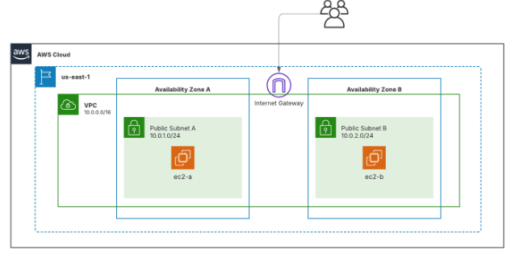

Exercici 1 – Infraestructura bàsica a AWS amb Terraform

Aquest exercici crea una infraestructura bàsica a AWS utilitzant Terraform.  
L’objectiu és desplegar una xarxa amb dues subxarxes públiques i dues instàncies EC2, tal com mostra el diagrama proporcionat.

Objectiu de la pràctica

- Configurar el proveïdor AWS a la regió us-east-1.
- Crear una VPC pròpia amb el rang d’adreces 10.0.0.0/16.
- Afegir dues subxarxes públiques (una per cada zona de disponibilitat).
- Configurar un Internet Gateway i una taula de rutes pública.
- Crear un grup de seguretat que controli els accessos.
- Llançar dues instàncies EC2 amb Amazon Linux, una a cada subxarxa.